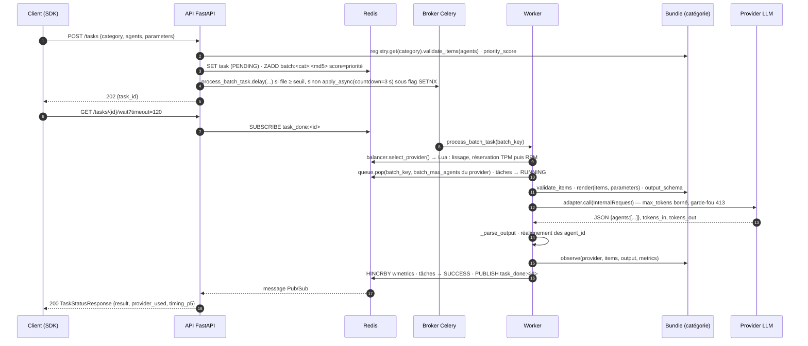

# Architecture

## Ports & adapters

The gateway is organised in concentric layers. At the centre, `core/`: the pydantic
models (`LLMRequest`, `Task`, `AgentItem`, `AgentResponse`, `InternalRequest`), the batch
key (`compute_batch_key`), the SWRR sequence (`build_swrr_sequence`). No I/O, no import
of Redis, Celery, httpx or FastAPI. Around it, `ports/`: `Protocol`s that say what the
gateway needs without saying how — `TaskStore` / `SyncTaskStore`, `BatchQueue`,
`RateLimiter`, `MetricsSink`, `LLMAdapter`, and the category contract
(`CategoryBundle`, `CategorySpec`, `ObserveContext`). Then the implementations: `infra/redis`
(Lua scripts for atomic reservation, `wmetrics` hash, Pub/Sub), `infra/memory` (pure
Python, for the tests and a future embedded mode), `adapters/` (one translator per provider
API). Finally the entry points: `api/` (FastAPI), `worker/` (Celery), `cli.py`,
`sdk/` (client).

## The five import-linter contracts

Checked by `lint-imports` from the repository root (`.importlinter`), in CI and by `make
lint-imports`. They are **forbidden** contracts: the source module may import none
of the forbidden modules, directly or transitively.

| Contract | Source | Forbidden | Why |
|---|---|---|---|
| `gateway-sans-metier` | `llm_gateway` | `mobility_core`, `mobility_llm`, `llm_module` | the gateway knows no domain; a reverse import would recreate the single package |
| `domaine-sans-gateway` | `mobility_core` | `llm_gateway`, `mobility_llm`, `llm_module`, `redis`, `celery`, `httpx`, `fastapi`, `jinja2` | the survey domain is usable without LLM or infra (eqasim, notebooks, scripts) |
| `colle-sans-coquille` | `mobility_llm` | `llm_module` | the glue imports the new packages, not the deprecated shell |
| `core-pur` | `llm_gateway.core` | `llm_gateway.{infra,api,worker,adapters,prompts}`, `redis`, `celery`, `httpx`, `fastapi` | the pure domain stays testable with nothing |
| `ports-purs` | `llm_gateway.ports` | `llm_gateway.{infra,api,worker,adapters}`, `redis`, `celery`, `httpx` | a port depends only on the core |

`mobility_llm` may import `llm_gateway` and `mobility_core`; it is the only arrow
allowed between the three packages.

## Explicit composition

Nothing is built at import. The factories assemble the dependencies and inject them:

- **API**: `create_app(config=None, deps=None)` → `build_deps(settings, registry=None)`
  builds two Redis clients (sync and async), `RedisTaskStore`, `RedisBatchQueue`,
  `RedisRateLimiter`, `RedisMetricsSink`, `LoadBalancer`, and the `CategoryRegistry`
  (`get_registry()` from the entry points, or the one passed in). The `GatewayDeps` container is
  attached to `app.state.deps`; the routes read it, never a singleton. The lifespan resets
  the RPM/TPM windows and warms up the broker connection — two startup steps
  of the API, not import side effects.
- **Worker**: `build_worker_runtime(settings, registry=None)` builds the same set with the
  sync client only (`WorkerRuntime`), at the first processing (`get_worker_runtime()` in
  `lru_cache`) — a worker can be imported without Redis. `celery_app = create_celery_app(get_settings())`
  stays at module level because the Celery command line requires it, but building the app
  does not touch Redis (lazy broker connection).
- **Tests**: `create_app(settings, deps=GatewayDeps(…ports mémoire…, registry=build_registry()))`.
  This is what `tests/integration/conftest.py` does.
- **Settings**: `Settings()` reads `providers.yaml` and the environment, computes
  `batch_max_agents` per provider; `get_settings()` (`lru_cache`) filters out the providers without
  a key. No Redis or network access.
- **Logging**: `configure_logging()` is called by the factories (`create_app`,
  `create_celery_app`), idempotent. It replaces the default loguru handler with a handler
  at level `telemetry.log_level` and, if `telemetry.service_name` is defined, adds a file
  `<telemetry.workdir>/<service>.log`. A host that only imports the SDK keeps its handlers.

## What the gateway does not know

It does not know what a persona, a transport mode, a trajectory or weather is. Nor does it
know what the priority score of a batch measures (for mobility: a
departure timestamp, the smallest in the batch). It knows how to: receive items with an `agent_id`,
ask the category to validate them, render a template with them, call a provider
while respecting its quotas, check that the response is a list of objects carrying an
`agent_id`, realign these identifiers, split the response per task, and give the validated
response to the category's `observe` hook so that it counts what interests it.

Three traces of the past remain on purpose, noted as assumptions of ticket 037:
`AgentResponse` keeps the fields typed "options" (`probabilities`, `chosen_index`,
`mode`) because the HTTP contract consumed by the SDK does not move (H5); the Prometheus
collector keeps the domain families because Grafana cites them (H11); `providers.yaml`
remains data of the package and is rewritten there (H8).

## Flow of a request

On a provider error, the worker puts the provider in cooldown or deactivates it,
puts the batch back in the queue and replays it — on the same provider (5xx, 429, learned 400) or on
another one (parse, 4xx, capacity) — according to the table in [Errors and alarms](../reference/erreurs-alarmes.md).

## What comes next

An execution port that allows an in-process executor without Celery; layered settings
prefixed `LLM_GATEWAY_` with `providers.yaml` out of the package; a generic
OpenAI-compatible adapter; exposure of the domain families declared by the bundle. These
points are listed in ticket 037 as later iterations.
