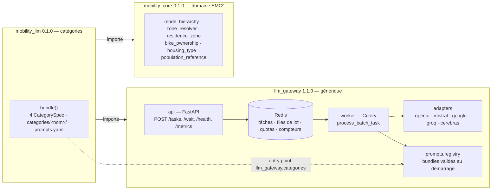

# llm-gateway

Asynchronous multi-provider gateway for LLM calls with structured output. A client submits
a batch of items per **category**; the gateway groups compatible batches into a single prompt,
chooses a provider according to its quotas, calls the model, validates the returned JSON against
the category's schema and gives each `agent_id` its result back.

The gateway **contains no prompt and knows no domain**. Categories are
brought by *bundles* installed alongside it and discovered through the
`llm_gateway.categories` entry point. This documentation covers the `llm_gateway` package
(version 1.1.0); the two sibling packages have their own README.

## The three packages



| Package | Role | Depends on |
|---|---|---|
| `llm_gateway` | API, worker, adapters, balancer, content-free Jinja2 engine, telemetry, SDK, config | nothing in the repository |
| `mobility_core` | rings, fine zones, mode hierarchy, equipment, housing, population calibration; no LLM or infra dependency | nothing in the repository |
| `mobility_llm` | `AgentSpec` persona, four categories, prompt variants, mode choice, domain metrics; registers with the gateway | the other two |

The arrows are contracts checked by import-linter (5 contracts, `.importlinter` at the
repository root): the gateway never imports mobility, the domain imports neither the gateway
nor any infra, `llm_gateway.core` and `llm_gateway.ports` stay pure.

## Where to start

| You want… | Page |
|---|---|
| to get a first response, from scratch | [First request](tutoriels/premiere-requete.md) |
| to plug in a new LLM provider | [Add a provider](guides/ajouter-un-provider.md) |
| to write your own prompt category | [Add a category](guides/ajouter-une-categorie.md) |
| to understand why a batch holds 2 agents and not 20 | [Tune the quotas](guides/regler-les-quotas.md) |
| to run or write tests | [Testing](guides/tester.md) |
| the list of environment variables | [Settings](reference/reglages.md) |
| the endpoints and their codes | [HTTP API](reference/api-http.md) |
| the Python client | [Python SDK](reference/sdk-python.md) and [Python API](reference/api-python.md) |
| the Prometheus families | [Metrics](reference/metriques.md) |
| what the worker does with an error | [Errors and alarms](reference/erreurs-alarmes.md) |
| the why of the structure | [Architecture](explications/architecture.md), [Batching, SWRR, circuit breaker](explications/batching-swrr-disjoncteur.md) |
| the decisions taken | [ADR 0001](adr/0001-trois-paquets.md), [ADR 0002](adr/0002-hook-de-categorie.md) |

## In three commands

```bash
pip install -e ./mobility_core -e ./llm_gateway[test] -e ./mobility_llm   # depuis la racine du dépôt
llm-gateway serve --port 8000                                             # l'API (Redis attendu sur localhost:6379)
llm-gateway worker --concurrency 25 --pool threads                        # le worker, autre terminal
```

With no bundle installed, `llm-gateway categories` returns code 1 and every request is refused
with 422. With `mobility_llm`, four categories are served.

## Status of the work

Ticket 037, iteration 1 (2026-09-07): three installable packages, deprecated `llm_module`
shell (removal planned for 2.0), 233 gateway tests, 5 import-linter contracts held. Postponed:
`LLM_GATEWAY_` prefix for environment variables, `providers.yaml` out of the package, generic
OpenAI-compatible adapter, executor without Celery, authentication, licence
([changelog](changelog.md)).
